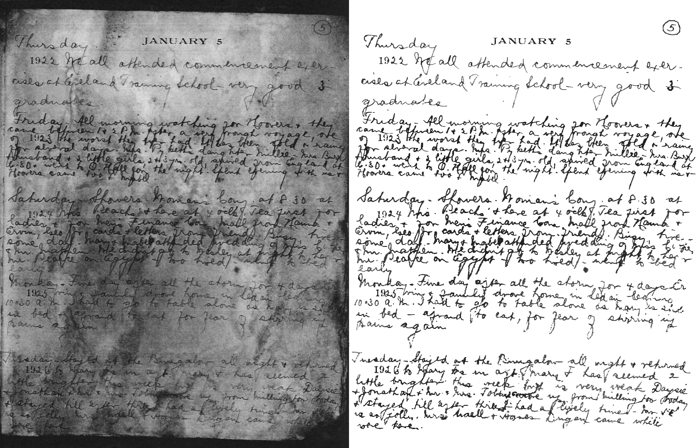

# Binarization Segformer

A semantic segmentation model for pixel-wise document image binarization.

## TODOs

- [ ] fine-tune Segformer on 1024 $\times$ 1024 images;
- [ ] set [`reduce_labels=True`](https://huggingface.co/docs/transformers/main/model_doc/segformer#transformers.SegformerImageProcessor.do_reduce_labels) in Segformer processor to ignore the background;
- [ ] vectorize DIBCO metrics from [here](https://github.com/Leedeng/SauvolaNet/blob/main/SauvolaDocBin/metrics.py) along the batch dimension;
- [ ] compare valid DIBCO metrics with SauvolaNet's [paper](https://arxiv.org/pdf/2105.05521.pdf).

## Overview

Segformer is an efficient semantic segmentation model introduced by [Xie et al.](https://arxiv.org/abs/2105.15203) in 2021.

In this repository, we will provide a fine-tuning of Segformer for pixel-wise document image binarization.

## Dataset

The dataset is an ensemble of 14 datasets replicating the setting used in SauvolaNet by [Li et al.](https://arxiv.org/abs/2105.05521) in 2021.

> Figure 1. An example pair from the Bickley diary dataset

For more information on the dataset, see SauvolaNet's official [repository](https://github.com/Leedeng/SauvolaNet).
